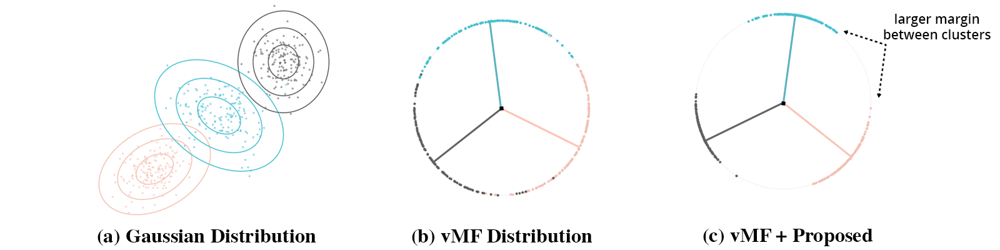
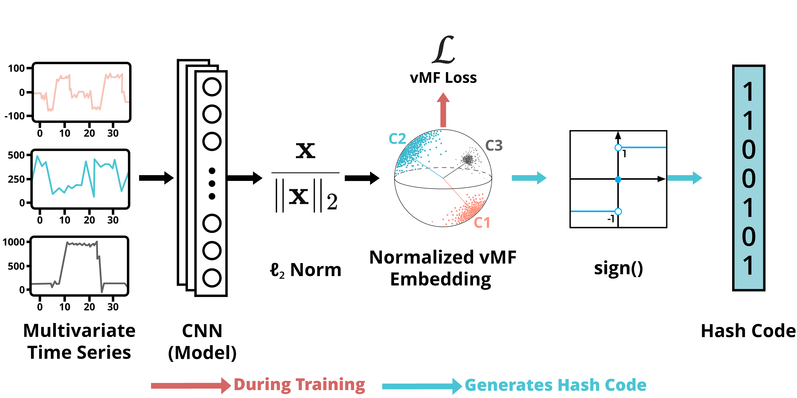

# vMF Hashing

This repository contains the implementation of the paper:

**Adaptive von Mises–Fisher Likelihood Loss for Supervised Deep Time Series Hashing (ICMLA'25).**

---

## Overview

This project introduces a supervised deep time series hashing framework that uses an adaptive von Mises–Fisher (vMF) likelihood loss to tackle the challenge of reducing information loss during binary code generation and improving the quality of learned representations.

Each class is modeled as a distinct vMF distribution, leading to more structured and meaningful representations.

The vMF loss is designed to maximize the separation between distributions, improving retrieval accuracy for semantically different time series.

We support multiple benchmark datasets (SHL, PAMAP2, CharacterTrajectories) and provide ready-to-use scripts for training, evaluation, and reproducibility.



---

## Main Reason for Using vMF

Our embeddings are normalized to the unit sphere before hashing, which makes the von Mises–Fisher (vMF) distribution a natural choice since it is specifically designed for modeling directional data. Unlike Gaussian assumptions in Euclidean space, vMF models similarity by angular distance, which directly aligns with cosine similarity and the discretization step used in hashing. This allows each class to be represented by a mean direction and concentration parameter, yielding structured and interpretable class prototypes. By optimizing the vMF log-likelihood, our framework encourages embeddings to align with their class centroid while increasing separation between different classes, effectively reducing information loss when converting to binary codes. This design provides stable training, meaningful class structure, and stronger retrieval performance, particularly when the hash code length is small, where traditional deep hashing methods often struggle.



**Overview of vMF approach.** Our model has three main components: a convolutional encoder that extracts high-level features from multivariate time series, a normalization step that projects these features onto the unit hypersphere, and a vMF-based loss that models each class as a von Mises–Fisher distribution. Together, these components provide a way to embed input time series into a hyperspherical latent space where samples from the same class are pulled toward a shared centroid, while samples from different classes are pushed apart. The vMF property is realized by promoting compact and well-separated clusters on the hypersphere, which both reduces information loss during binarization and improves the discriminative power of the resulting hash codes.

---

## Requirements

The recommended requirements for our method are specified as follows:  

- Python 3.10  
- torch==2.2.2  
- torchvision==0.17.2  
- numpy==1.26.2  
- scipy==1.12.0  
- scikit-learn==1.6.1  
- scikit-image==0.25.2  
- pandas==2.2.3  
- seaborn==0.13.2  
- imageio==2.37.0  
- h5py==3.14.0  
- matplotlib==3.10.0  

The dependencies can be installed by:  

```bash
pip install -r requirements.txt
```
---

## Datasets

To reproduce our experiments, download the prepared dataset archive from the following link:  

➡️ [Download Datasets (Google Drive, ~854 MB)](https://drive.google.com/file/d/17FeFHAFcPVmCKB2CnWDVdKQ222cncOZt/view?usp=sharing)

Once downloaded, unzip the archive and place the folder inside the project root (`vmf-hashing/`).

### Dataset Description

All datasets are provided in a preprocessed format for direct use with our code.

- **Labels are zero-based** (e.g., if there are 20 classes, they are labeled 0–19).
- **Splits are Training and Testing only** (no validation split is included).
- **Do not subtract 1 from labels** in your code. If your pipeline assumes 1-based labels, you must adjust it.

### Expected Format  
Each dataset folder must contain four `.npy` files:  

- **x_train.npy** – training features  
- **y_train.npy** – training labels  
- **x_test.npy** – testing features  
- **y_test.npy** – testing labels  

### Data Splits  
- The provided datasets are already split 80% training, 20% testing.
- During training, our code further creates a validation set from the training data.


#### Summary

| Dataset              | Classes | Label Range | Train Samples | Test Samples |
|----------------------|---------|-------------|---------------|--------------|
| [SHL](http://www.shl-dataset.org/dataset/)                  | 2       | 0–1         | 10,208  | 2,553 |
| [PAMAP2](https://archive.ics.uci.edu/dataset/231/pamap2+physical+activity+monitoring)               | 12      | 0–11        | 11,588        | 2,897        |
| [CharacterTrajectories](https://www.timeseriesclassification.com/description.php?Dataset=CharacterTrajectories)| 20      | 0–19        | 1,137  | 285 |

### Important!

Keep all files inside their respective dataset folder without renaming or moving them.

When adding new datasets, follow the same naming format (x_train.npy, y_train.npy, x_test.npy, y_test.npy).

---

## How to Run

Update the `folder_name` parameter in the **`load_data()`** function inside `data_loader.py` to point to the dataset folder you're going to use.

```bash
def load_data(folder_name='datasets/CHANGE_HERE', mode="train"):
```

To train, run the following command:

```bash
 python train.py
```

It'll save the best model as **`best_hashnet_model.pth`**

Once it's done training, then run:

```bash
 python evaluate.py
```

to get the mAP.

